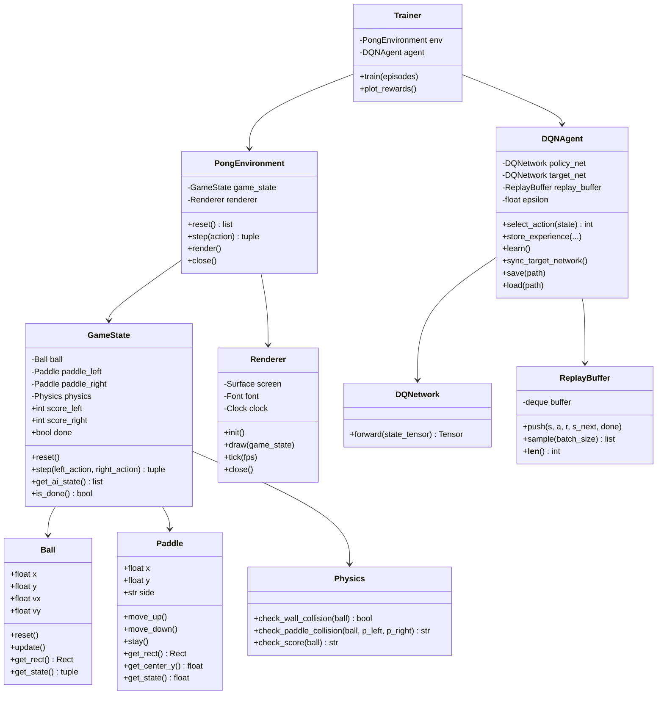

# AI Pong Game — Design Document

**Version:** 1.0
**Project:** AIPongGame
**Language:** Python 3.11+
**AI Type:** Deep Q-Network (DQN) — Reinforcement Learning
**Cloud AI Required:** No — fully local
**Design Pattern:** Object-Oriented Programming (OOP) — every service is a class; utility functions are allowed in `src/utils/`

---

## Table of Contents

1. [Overview](#1-overview)
2. [AI Approach — Why DQN, Not an LLM](#2-ai-approach--why-dqn-not-an-llm)
3. [Layered Architecture](#3-layered-architecture)
4. [Layer Descriptions](#4-layer-descriptions)
   - [Layer 0 — Configuration](#layer-0--configuration)
   - [Layer 1 — Core Game Entities](#layer-1--core-game-entities)
   - [Layer 2 — Game Engine](#layer-2--game-engine)
   - [Layer 3 — AI Brain](#layer-3--ai-brain)
   - [Layer 4 — Application](#layer-4--application)
5. [Dependency Rules](#5-dependency-rules)
6. [OOP Class Hierarchy](#6-oop-class-hierarchy)
7. [File Structure](#7-file-structure)
8. [Data Flow](#8-data-flow)
9. [Neural Network Design](#9-neural-network-design)
10. [Reward Function](#10-reward-function)
11. [Training Strategy](#11-training-strategy)
12. [Visual Training Display](#12-visual-training-display)
13. [Difficulty Levels](#13-difficulty-levels)
14. [Tech Stack](#14-tech-stack)
15. [Package Management — uv](#15-package-management--uv)
16. [Game Rules](#16-game-rules)

---

## 1. Overview

This project implements the classic **Pong** arcade game (Atari, 1972) using `pygame`, with an AI opponent trained via **Deep Q-Network (DQN)** Reinforcement Learning using `PyTorch`.

The game has two modes:
- **`--train`** — Runs the AI in a headless training loop against a rule-based bot to learn the game
- **`--play`** — Loads the trained model and lets a human player compete against the AI

No cloud APIs, no LLMs, no internet connection required. The AI is trained and runs entirely on the local machine.

---

## 2. AI Approach — Why DQN, Not an LLM

| Criterion | LLM (Claude/GPT/Gemini) | DQN (our choice) |
|-----------|------------------------|------------------|
| Speed | ~500ms per response | <1ms per decision |
| Cost | API cost per call | Free, local |
| Internet required | Yes | No |
| Suited for real-time games | No | Yes |
| Learns from experience | No | Yes |
| Understands game state | Via text prompt | Via numeric state vector |

**DQN** is the correct tool here. It is the same algorithm DeepMind used to train AI to play Atari Pong in 2013 (the paper that started the deep RL revolution). The AI:

1. **Observes** the game state as a vector of 6 numbers
2. **Selects** an action: move UP, move DOWN, or STAY
3. **Receives** a reward signal based on what happened
4. **Learns** over thousands of episodes which actions lead to winning

This is **Reinforcement Learning** — not supervised learning, not an LLM.

---

## 3. Layered Architecture

The project follows a **strict layered architecture** where **lower layers have no knowledge of higher layers**. This mirrors the classic web application pattern (Database → Repository → Service → Controller → UI).

```
┌─────────────────────────────────────────────────────────┐
│              LAYER 4 — APPLICATION                      │
│         main.py  (entry point, CLI, orchestration)      │
└────────────────────────┬────────────────────────────────┘
                         │ uses
┌────────────────────────▼────────────────────────────────┐
│              LAYER 3 — AI BRAIN                         │
│   environment.py  │  dqn_agent.py  │  trainer.py        │
│   neural_net.py   │  replay_buffer.py                   │
└────────────────────────┬────────────────────────────────┘
                         │ uses
┌────────────────────────▼────────────────────────────────┐
│              LAYER 2 — GAME ENGINE                      │
│   game_state.py  │  physics.py  │  renderer.py          │
└────────────────────────┬────────────────────────────────┘
                         │ uses
┌────────────────────────▼────────────────────────────────┐
│              LAYER 1 — CORE GAME ENTITIES               │
│          ball.py  │  paddle.py                          │
└────────────────────────┬────────────────────────────────┘
                         │ uses
┌────────────────────────▼────────────────────────────────┐
│              LAYER 0 — CONFIGURATION                    │
│                    config.py                            │
└─────────────────────────────────────────────────────────┘
```

**Rule:** An arrow points downward only. No module in Layer N may import from Layer N+1 or above.

---

## 4. Layer Descriptions

---

### Layer 0 — Configuration

**Path:** `src/utils/config.py`  
**Responsibility:** Single source of truth for all constants. No logic, no imports from other project modules.

**Contents:**

```
GameConfig:
  WINDOW_WIDTH      = 800
  WINDOW_HEIGHT     = 600
  FPS               = 60
  BALL_SPEED        = 5
  BALL_RADIUS       = 10
  PADDLE_WIDTH      = 15
  PADDLE_HEIGHT     = 90
  PADDLE_SPEED      = 6
  WINNING_SCORE     = 10
  BACKGROUND_COLOR  = (0, 0, 0)
  FOREGROUND_COLOR  = (255, 255, 255)

AIConfig:
  STATE_SIZE        = 6       # input neurons
  ACTION_SIZE       = 3       # UP, DOWN, STAY
  HIDDEN_SIZE       = 128
  LEARNING_RATE     = 0.001
  GAMMA             = 0.99    # discount factor
  EPSILON_START     = 1.0     # exploration rate start
  EPSILON_END       = 0.01    # exploration rate floor
  EPSILON_DECAY     = 0.995
  REPLAY_BUFFER_SIZE= 10000
  BATCH_SIZE        = 64
  TARGET_UPDATE_FREQ= 100     # steps between target net sync
  EPISODES          = 5000

RewardConfig:
  SCORE_POINT       = +10.0
  MISS_POINT        = -10.0
  RETURN_BALL       = +1.0
  SURVIVE_STEP      = +0.1
```

---

### Layer 1 — Core Game Entities

**Path:** `src/game/`  
**Imports allowed:** `Layer 0 (config)` only  
**Responsibility:** Pure data + behaviour of individual game objects. No rendering, no game logic, no AI.

#### `ball.py` — Ball Entity

```
class Ball:
  Attributes:
    x, y          : float   — current position (center)
    vx, vy        : float   — velocity vector
    radius        : int     — from config

  Methods:
    reset()                 — place ball at center with random direction
    update()                — advance position by velocity (no collision here)
    get_rect()              — return pygame.Rect for collision detection
    get_state()             — return (x, y, vx, vy) normalized to [0,1]
```

#### `paddle.py` — Paddle Entity

```
class Paddle:
  Attributes:
    x, y          : float   — top-left position
    width, height : int     — from config
    speed         : int     — from config
    side          : str     — 'left' or 'right'

  Methods:
    move_up()               — decrease y, clamp to screen bounds
    move_down()             — increase y, clamp to screen bounds
    stay()                  — no movement
    get_rect()              — return pygame.Rect for collision detection
    get_center_y()          — return center y position
    get_state()             — return normalized y position in [0,1]
```

---

### Layer 2 — Game Engine

**Path:** `src/game/`  
**Imports allowed:** `Layer 0`, `Layer 1`  
**Responsibility:** Orchestrates entities, handles physics, manages score, renders the scene. No AI logic.

#### `physics.py` — Collision Engine

```
class Physics:
  Methods:
    check_wall_collision(ball)
      — if ball.y <= 0 or ball.y >= HEIGHT: reverse vy
      — return True if collision occurred

    check_paddle_collision(ball, paddle_left, paddle_right)
      — use pygame.Rect.colliderect()
      — on hit: reverse vx, slightly randomize vy for unpredictability
      — return which paddle was hit (None, 'left', 'right')

    check_score(ball)
      — if ball.x < 0: right player scores
      — if ball.x > WIDTH: left player scores
      — return ('left', 'right', or None)
```

#### `game_state.py` — State Manager

```
class GameState:
  Attributes:
    ball          : Ball
    paddle_left   : Paddle    — human player
    paddle_right  : Paddle    — AI player
    score_left    : int
    score_right   : int
    physics       : Physics
    done          : bool      — True when a player reaches winning score

  Methods:
    reset()                   — reset ball, paddles, scores
    step(left_action, right_action)
      — apply actions to paddles
      — update ball position
      — run physics checks
      — update scores
      — return (reward_left, reward_right, done)
    get_ai_state()            — return 6-float state vector for AI
    is_done()                 — return done flag
```

**State vector returned by `get_ai_state()`:**

| Index | Value | Normalized |
|-------|-------|------------|
| 0 | ball_x | / WINDOW_WIDTH |
| 1 | ball_y | / WINDOW_HEIGHT |
| 2 | ball_vx | / MAX_SPEED |
| 3 | ball_vy | / MAX_SPEED |
| 4 | ai_paddle_y | / WINDOW_HEIGHT |
| 5 | player_paddle_y | / WINDOW_HEIGHT |

#### `renderer.py` — Rendering Layer

```
class Renderer:
  Attributes:
    screen        : pygame.Surface
    font          : pygame.Font
    clock         : pygame.Clock

  Methods:
    init()                    — initialize pygame window
    draw(game_state)          — draw background, ball, paddles, score, center line
    tick(fps)                 — enforce frame rate
    close()                   — quit pygame
```

**Note:** `Renderer` is only used in play mode. Training mode runs headless (no window).

---

### Layer 3 — AI Brain

**Path:** `src/ai/`  
**Imports allowed:** `Layer 0`, `Layer 1`, `Layer 2`  
**Responsibility:** All AI logic — neural network, agent decisions, experience replay, training loop.

#### `neural_net.py` — Policy Network

```
class DQNetwork(nn.Module):
  Architecture:
    Linear(6, 128)  → ReLU
    Linear(128, 128) → ReLU
    Linear(128, 3)   → (raw Q-values, no activation)

  Methods:
    forward(state_tensor) → Q-values tensor of shape [batch, 3]
```

Two instances are created:
- **Policy Net** — updated every step via backpropagation
- **Target Net** — copy of policy net, updated every N steps (stabilizes training)

#### `replay_buffer.py` — Experience Memory

```
class ReplayBuffer:
  Attributes:
    capacity      : int       — max experiences stored (FIFO)
    buffer        : deque     — circular buffer of experiences

  Experience tuple: (state, action, reward, next_state, done)

  Methods:
    push(state, action, reward, next_state, done)
    sample(batch_size) → list of experience tuples
    __len__()          → current buffer size
```

#### `dqn_agent.py` — DQN Agent

```
class DQNAgent:
  Attributes:
    policy_net    : DQNetwork
    target_net    : DQNetwork
    optimizer     : Adam
    replay_buffer : ReplayBuffer
    epsilon       : float     — current exploration rate
    steps_done    : int

  Methods:
    select_action(state)
      — with probability epsilon: random action (explore)
      — otherwise: argmax(policy_net(state)) (exploit)
      — return action index: 0=UP, 1=DOWN, 2=STAY

    store_experience(state, action, reward, next_state, done)
      — push to replay buffer

    learn()
      — if buffer < BATCH_SIZE: return
      — sample mini-batch from replay buffer
      — compute Q-targets using Bellman equation:
          Q_target = reward + GAMMA * max(target_net(next_state)) * (1 - done)
      — compute loss: MSE(policy_net(state)[action], Q_target)
      — backpropagate and update policy_net weights
      — decay epsilon

    sync_target_network()
      — copy policy_net weights to target_net

    save(path)    — torch.save model weights
    load(path)    — torch.load model weights
```

**Bellman Equation (the core of DQN):**

```
Q(s, a) = r + γ · max_a'[ Q_target(s', a') ]
```

Where:
- `s` = current state
- `a` = action taken
- `r` = reward received
- `s'` = next state
- `γ` = discount factor (how much future rewards matter)

#### `environment.py` — Gym-like Wrapper

```
class PongEnvironment:
  Attributes:
    game_state    : GameState
    renderer      : Renderer  (optional, None in headless mode)

  Methods:
    reset() → initial_state
      — call game_state.reset()
      — return get_ai_state()

    step(action) → (next_state, reward, done)
      — translate action index to paddle movement
      — call game_state.step(bot_action, ai_action)
      — return new state, reward for AI, done flag

    render()
      — if renderer is not None: draw current game_state

    close()
      — if renderer: renderer.close()
```

#### `trainer.py` — Training Orchestrator

```
class Trainer:
  Attributes:
    env           : PongEnvironment
    agent         : DQNAgent
    episode_rewards : list

  Methods:
    train(episodes)
      — for each episode:
          state = env.reset()
          while not done:
            action = agent.select_action(state)
            next_state, reward, done = env.step(action)
            agent.store_experience(state, action, reward, next_state, done)
            agent.learn()
            state = next_state
          — every TARGET_UPDATE_FREQ steps: agent.sync_target_network()
          — log episode reward and epsilon
          — every 500 episodes: agent.save(models/checkpoint.pth)
      — agent.save(models/trained_model.pth)

    plot_rewards()
      — display matplotlib chart of reward per episode
```

---

### Layer 4 — Application

**Path:** `main.py`  
**Imports allowed:** All layers  
**Responsibility:** Entry point only. Parses CLI arguments, wires together components, starts the correct mode.

```
main.py:
  parse args: --train | --play

  if --train:
    env = PongEnvironment(headless=True)
    agent = DQNAgent()
    trainer = Trainer(env, agent)
    trainer.train(episodes=AIConfig.EPISODES)

  if --play:
    env = PongEnvironment(headless=False)
    agent = DQNAgent()
    agent.load('models/trained_model.pth')
    run_play_loop(env, agent)
      — handle pygame events (keyboard input for human paddle)
      — agent selects action for AI paddle
      — env.step(human_action, ai_action)
      — env.render()
```

---

## 5. Dependency Rules

```
Layer 4 (main.py)         → can import from Layers 0, 1, 2, 3
Layer 3 (src/ai/)         → can import from Layers 0, 1, 2
Layer 2 (src/game/ engine)→ can import from Layers 0, 1
Layer 1 (src/game/ entities)→ can import from Layer 0 only
Layer 0 (src/utils/)      → no project imports
```

**Violations that are FORBIDDEN:**
- `ball.py` importing from `game_state.py` (Layer 1 → Layer 2)
- `physics.py` importing from `dqn_agent.py` (Layer 2 → Layer 3)
- `environment.py` importing from `main.py` (Layer 3 → Layer 4)
- Any circular imports

---

## 6. OOP Class Hierarchy

This project is **strictly object-oriented**. Every service, entity, and subsystem is encapsulated in a class. Free functions are only permitted in `src/utils/` as stateless utility helpers.

### Class Map

```
src/utils/config.py
└── GameConfig          (dataclass)   — game window/physics constants
└── AIConfig            (dataclass)   — neural network hyperparameters
└── RewardConfig        (dataclass)   — reward signal values

src/game/ball.py
└── Ball                (class)       — ball entity: position, velocity, collision rect

src/game/paddle.py
└── Paddle              (class)       — paddle entity: position, movement, bounds clamping

src/game/physics.py
└── Physics             (class)       — stateless collision service; methods take entities as args

src/game/game_state.py
└── GameState           (class)       — owns Ball + 2x Paddle + Physics; manages score + step logic

src/game/renderer.py
└── Renderer            (class)       — owns pygame surface; draws GameState each frame

src/ai/neural_net.py
└── DQNetwork           (nn.Module)   — PyTorch neural network: forward pass only

src/ai/replay_buffer.py
└── ReplayBuffer        (class)       — circular deque of Experience namedtuples

src/ai/dqn_agent.py
└── DQNAgent            (class)       — owns policy_net + target_net + ReplayBuffer + optimizer

src/ai/environment.py
└── PongEnvironment     (class)       — owns GameState + optional Renderer; exposes reset/step/render

src/ai/trainer.py
└── Trainer             (class)       — owns PongEnvironment + DQNAgent; runs training loop
```

### OOP Principles Applied

| Principle | How it is applied |
|-----------|------------------|
| **Encapsulation** | Each class owns its own state; no external mutation of private attributes |
| **Single Responsibility** | `Physics` only detects collisions; `Renderer` only draws; `DQNAgent` only decides and learns |
| **Dependency Injection** | `GameState` receives `Ball` and `Paddle` instances; `Trainer` receives `PongEnvironment` and `DQNAgent` |
| **Separation of Concerns** | Game logic is completely isolated from AI logic via the `PongEnvironment` boundary |
| **No God Classes** | `main.py` wires components together but contains no business logic itself |

### Class Interaction Diagram



---

## 7. File Structure

```
AIPongGame/
├── src/
│   ├── game/
│   │   ├── __init__.py
│   │   ├── ball.py              # Layer 1 — Ball entity
│   │   ├── paddle.py            # Layer 1 — Paddle entity
│   │   ├── physics.py           # Layer 2 — Collision detection
│   │   ├── game_state.py        # Layer 2 — State manager
│   │   └── renderer.py          # Layer 2 — pygame rendering
│   ├── ai/
│   │   ├── __init__.py
│   │   ├── neural_net.py        # Layer 3 — PyTorch DQN network
│   │   ├── replay_buffer.py     # Layer 3 — Experience memory
│   │   ├── dqn_agent.py         # Layer 3 — DQN agent
│   │   ├── environment.py       # Layer 3 — Gym-like wrapper
│   │   └── trainer.py           # Layer 3 — Training orchestrator
│   └── utils/
│       ├── __init__.py
│       └── config.py            # Layer 0 — All constants
├── models/
│   ├── trained_model.pth        # Final saved model weights
│   └── checkpoint.pth           # Periodic checkpoint during training
├── plans/
│   └── design.md                # This document
├── main.py                      # Layer 4 — Entry point
├── pyproject.toml               # uv project manifest and dependencies
├── uv.lock                      # Auto-generated locked dependency versions
├── .python-version              # Pinned Python version (e.g. 3.11)
├── .gitignore
└── README.md
```

---

## 7. Data Flow

### Training Mode

```
Trainer.train()
    │
    ├─► env.reset()
    │       └─► GameState.reset() → Ball.reset(), Paddle positions reset
    │           └─► returns state vector [6 floats]
    │
    └─► loop:
            │
            ├─► DQNAgent.select_action(state)
            │       └─► DQNetwork.forward(state) → Q-values → argmax
            │
            ├─► env.step(action)
            │       ├─► Paddle.move_up/down/stay()
            │       ├─► Ball.update()
            │       ├─► Physics.check_wall_collision()
            │       ├─► Physics.check_paddle_collision()
            │       ├─► Physics.check_score()
            │       └─► returns (next_state, reward, done)
            │
            ├─► DQNAgent.store_experience(...)
            │       └─► ReplayBuffer.push(...)
            │
            └─► DQNAgent.learn()
                    ├─► ReplayBuffer.sample(batch_size)
                    ├─► DQNetwork.forward(states) → Q-values
                    ├─► TargetNetwork.forward(next_states) → Q-targets
                    ├─► Compute Bellman loss
                    └─► Backpropagate → update weights
```

### Play Mode

```
main.py play loop
    │
    ├─► pygame.event.get() → human keyboard input → human_action
    │
    ├─► DQNAgent.select_action(state) → ai_action  (epsilon=0, pure exploit)
    │
    ├─► env.step(human_action, ai_action)
    │       └─► GameState.step() → physics → new state + reward
    │
    └─► env.render()
            └─► Renderer.draw(game_state) → pygame display update
```

---

## 8. Neural Network Design

```
Input Layer:   6 neurons
               [ball_x, ball_y, ball_vx, ball_vy, ai_paddle_y, player_paddle_y]
               All values normalized to [0, 1]

Hidden Layer 1: 128 neurons, ReLU activation
Hidden Layer 2: 128 neurons, ReLU activation

Output Layer:  3 neurons (no activation — raw Q-values)
               [Q(UP), Q(DOWN), Q(STAY)]

Action selected: argmax of output
```

**Why not use raw pixels?**  
Using the numeric state vector (6 floats) instead of pixel images means:
- Training converges in minutes instead of hours
- No need for a GPU
- No convolutional layers needed
- The network is tiny and fast

---

## 9. Reward Function

| Event | Reward | Rationale |
|-------|--------|-----------|
| AI scores a point | `+10.0` | Primary goal |
| AI misses the ball | `-10.0` | Primary failure |
| AI successfully returns the ball | `+1.0` | Encourage active play |
| Each timestep the AI survives | `+0.1` | Encourage staying in the game |

The reward is computed inside `GameState.step()` and returned to the environment, which passes it to the agent.

---

## 10. Training Strategy

### Phase 1 — Warm-up vs Rule-Based Bot

The AI trains against a simple **rule-based bot** on the left paddle:

```python
# Rule-based bot: always move toward the ball
if ball.y > paddle.get_center_y():
    return Action.DOWN
elif ball.y < paddle.get_center_y():
    return Action.UP
else:
    return Action.STAY
```

This provides **dense, consistent feedback** and allows the AI to learn the basics quickly.

### Phase 2 — Self-Play (Optional Enhancement)

After initial training, the AI can play against a copy of itself. This is how AlphaGo and AlphaZero achieved superhuman performance. For Pong, Phase 1 is sufficient.

### Hyperparameters

| Parameter | Value | Purpose |
|-----------|-------|---------|
| Episodes | 5000 | Total training games |
| Epsilon start | 1.0 | 100% random at start |
| Epsilon end | 0.01 | 1% random at end |
| Epsilon decay | 0.995 | Per-episode decay |
| Gamma | 0.99 | Future reward discount |
| Learning rate | 0.001 | Adam optimizer step size |
| Batch size | 64 | Experiences per learning step |
| Replay buffer | 10,000 | Memory capacity |
| Target net sync | every 100 steps | Stabilizes Q-targets |

### Expected Training Progress

| Episodes | Expected Behavior |
|----------|------------------|
| 0–500 | Random movement, frequent misses |
| 500–1500 | Starts tracking the ball |
| 1500–3000 | Consistent returns, learning to score |
| 3000–5000 | Competitive play, strategic positioning |

---

## 12. Visual Training Display

During training, a **live matplotlib dashboard** updates every 50 episodes in a separate window alongside the headless game loop. This is implemented as a dedicated `TrainingVisualizer` class in `src/ai/visualizer.py` (Layer 3).

### What is Displayed

```
┌──────────────────────────────────────────────────────────────┐
│  [Top-left]  Episode Reward        [Top-right]  Win Rate     │
│              (raw + rolling avg)                (last 100)   │
│  ▁▂▃▄▅▆▇████████████████          0% ──► 35% ──► 72%        │
│                                                              │
│  [Bot-left]  Epsilon Decay         [Bot-right]  Steps/Ep    │
│              1.0 ↘ 0.01            ▁▃▅▇▇▇▇▇▇▇▇▇▇▇▇▇         │
└──────────────────────────────────────────────────────────────┘
```

### TrainingVisualizer Class

```
class TrainingVisualizer:
  Attributes:
    fig           : matplotlib.Figure   — 2x2 subplot grid
    episode_rewards : list[float]
    win_rates       : list[float]
    epsilons        : list[float]
    steps_per_ep    : list[int]
    update_interval : int               — redraw every N episodes (default: 50)

  Methods:
    record(episode_reward, won, epsilon, steps)
      — append data to all tracking lists

    update()
      — clear and redraw all 4 subplots
      — draw rolling average (window=100) over raw reward
      — call plt.pause(0.001) for non-blocking update

    save(path)
      — save final chart as PNG to models/training_plot.png

    close()
      — plt.close()
```

### Integration with Trainer

`Trainer` owns a `TrainingVisualizer` instance. After each episode:
```python
self.visualizer.record(episode_reward, won, agent.epsilon, steps)
if episode % self.visualizer.update_interval == 0:
    self.visualizer.update()
self.visualizer.save("models/training_plot.png")
```

---

## 13. Difficulty Levels

Difficulty is selected at launch via CLI: `uv run python main.py --play --difficulty hard`

Difficulty does **not** retrain the model. It applies behavioral constraints to the trained AI at inference time, implemented via a `Difficulty` enum and `DifficultyConfig` dataclass in `src/utils/config.py`.

### Difficulty Enum

```python
class Difficulty(Enum):
    EASY   = "easy"
    MEDIUM = "medium"
    HARD   = "hard"
    INSANE = "insane"
```

### DifficultyConfig Dataclass

```python
@dataclass
class DifficultyConfig:
    paddle_speed_multiplier : float   # scales AI paddle speed
    action_skip_frames      : int     # AI skips N frames before acting (reaction delay)
    epsilon_override        : float   # forced random action rate (0.0 = pure exploit)
    ball_speed_multiplier   : float   # scales ball speed for extra challenge
```

### Difficulty Presets

| Difficulty | Paddle Speed | Reaction Delay | Random Moves | Ball Speed |
|-----------|-------------|---------------|-------------|-----------|
| **Easy** | 50% | every 4 frames | 30% random | 1.0x |
| **Medium** | 75% | every 2 frames | 10% random | 1.0x |
| **Hard** | 100% | no delay | 0% random | 1.0x |
| **Insane** | 100% | no delay | 0% random | 1.4x |

### How It Works

`PongEnvironment` receives a `DifficultyConfig` at construction. On each `step()`:

1. **Reaction delay:** if `action_skip_frames > 0`, the AI reuses its last action for N frames before querying the network again
2. **Paddle speed:** `Paddle.speed` is multiplied by `paddle_speed_multiplier` for the AI paddle only
3. **Epsilon override:** `DQNAgent.select_action()` uses `max(agent.epsilon, difficulty.epsilon_override)` in play mode
4. **Ball speed:** `GameConfig.BALL_SPEED` is multiplied by `ball_speed_multiplier` at game reset

### Menu Screen

A simple **difficulty selection screen** is shown before the game starts in play mode, rendered by `Renderer`:

```
┌─────────────────────────────┐
│       AI PONG               │
│                             │
│   Select Difficulty:        │
│                             │
│   [1] Easy                  │
│   [2] Medium                │
│   [3] Hard                  │
│   [4] Insane                │
│                             │
│   Press number to start     │
└─────────────────────────────┘
```

---

## 14. Tech Stack

| Component | Library | Version | Purpose |
|-----------|---------|---------|---------|
| Game Engine | `pygame` | 2.5+ | Window, rendering, input, clock |
| Neural Network | `torch` | 2.0+ | DQN forward/backward pass |
| Numerics | `numpy` | 1.24+ | State vector operations |
| Visualization | `matplotlib` | 3.7+ | Live training dashboard + reward plots |
| Package Manager | `uv` | 0.4+ | Fast Python package and project manager |

**No cloud dependencies. No API keys. Runs offline.**

---

## 15. Package Management — uv

This project uses [`uv`](https://docs.astral.sh/uv/) — a modern, extremely fast Python package manager written in Rust (by Astral, the makers of `ruff`). It replaces `pip`, `pip-tools`, `virtualenv`, and `pyenv` in a single tool.

### Why uv?

| Feature | pip + venv | uv |
|---------|-----------|-----|
| Speed | Slow | 10-100x faster |
| Lock file | No (needs pip-tools) | Built-in `uv.lock` |
| Python version management | No (needs pyenv) | Built-in |
| Single tool | No | Yes |

### Project Manifest

`uv` uses `pyproject.toml` as the project manifest (PEP 517/518 standard). There is **no `requirements.txt`** — `pyproject.toml` is the single source of truth for dependencies.

```toml
# pyproject.toml
[project]
name = "ai-pong-game"
version = "0.1.0"
requires-python = ">=3.11"
dependencies = [
    "pygame>=2.5",
    "torch>=2.0",
    "numpy>=1.24",
    "matplotlib>=3.7",
]

[build-system]
requires = ["hatchling"]
build-backend = "hatchling.build"
```

A `uv.lock` file is auto-generated and **committed to version control** for fully reproducible installs across machines.

### Setup Commands

```bash
# Install uv (macOS/Linux — one-time)
curl -LsSf https://astral.sh/uv/install.sh | sh

# Clone the repo and install all dependencies
uv sync

# Run the game (uv activates the venv automatically)
uv run python main.py --train
uv run python main.py --play

# Add a new dependency
uv add some-package
```

### uv-specific Files in Project Root

| File | Purpose | Committed? |
|------|---------|-----------|
| `pyproject.toml` | Project metadata and dependencies | Yes |
| `uv.lock` | Exact locked versions of all deps | Yes |
| `.python-version` | Pinned Python version e.g. `3.11` | Yes |
| `.venv/` | Virtual environment directory | No (gitignored) |

---

## 16. Game Rules

Based on the original Atari Pong (1972):

- The playing field is a rectangle with walls on top and bottom
- Each player controls a vertical paddle on their side of the screen
- A ball bounces between paddles
- If the ball passes a paddle, the opposing player scores a point
- First player to reach **10 points** wins
- After each point, the ball resets to the center
- Ball speed may increase slightly with each successful return (optional difficulty scaling)

**Controls (Play Mode):**

| Key | Action |
|-----|--------|
| `W` | Move player paddle up |
| `S` | Move player paddle down |
| `ESC` | Quit game |

**Player:** Left paddle (keyboard)  
**AI:** Right paddle (trained DQN model)
